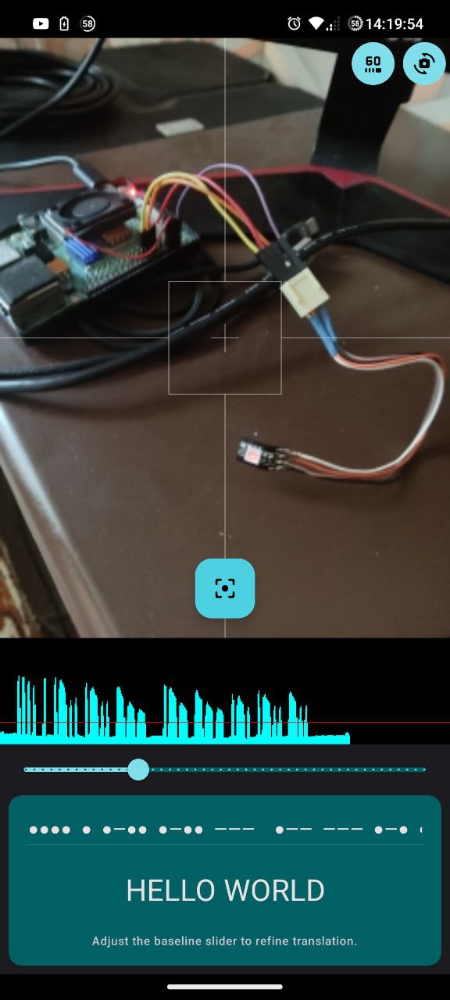

# MorseToLed

Проект который я делал для конкурса от НКБ ВС, нужно было передать информацию через свет с помощью linux устройства (передатчик) и android смартфона (получатель).

Здесь представлена часть проекта для Raspberry Pi, которая передаёт информацию с помощью морзе. Далее планировалось перенести код в библиотеку и написать в ней небольшой преобразователь текста в морзе, а так же обеспечить возможность подключить внешний преобразователь текста в морзе в стиле Dependency Injection.

## Но

На этапе разработки приложения под android, я хотел попробовать Avalonia framework, но он оказался ещё слишком сырым для android, поэтому я перешёл на maui, но и там всё было не так просто. Так же 2-х летнее расставание с Android studio не позволило бы мне написать приложение в оставшееся время.

# Результат

* Этот репозиторий
* Добавление поддержки русского языка в библиотеку [MorseSharp](https://github.com/p6laris/MorseSharp)

Для откладки этого проекта я нашёл готовое приложение на android [MorseBuddy](https://github.com/anantaraha/morsebuddy) и с его помощью добился скорости стабильного чтения в 65 у.е.

Так же вдохновлялся этим проектом, из которого подчеркнул идею считывания на основе яркости пикселя ([ссылка](https://www.codeproject.com/Articles/46174/Computer-Vision-Decoding-a-Morse-Code-Flashing-LED))

### Скорость

В коде 1 у.е.равна 1 мс

`В скобочках результат при 65 у.е.`
* `.` - 1 у.е. (65 мс)
* `-` - 3 у.е. (195 мс)
* `меж слов` - 1 у.е. (65 м + два пробела = 195 мс) 
* `пробел` - 1 у.е. (65 м)

# Библиотеки

* [MorseSharp](https://github.com/p6laris/MorseSharp)